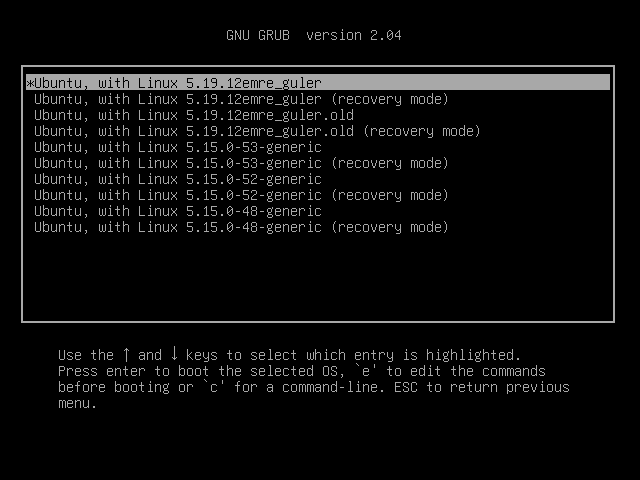

# Writing-a-System-Call
This repository is a Medeniyet University BIL301 - Operating Systems (Fall22) HomeWork1

One or two details may differ depending on the kernel versions you are using. Since the purpose of this repository is to show you how to add system call, there are many examples on the web, you can also benefit from them

## What to Know in Advance
- C and system programming (Calling a system calls via C program)
- Kernel, User space, Kernel space etc. definitions
- Linux Terminal

## Learning Objectives
-  Compile the Linux kernel
-  Adding a new system call by making changes on the kernel
-  Copying data from user space to kernel space (with copy_from_user or strncpy_from_user).
-  Learn how to test the operation of the added system call by calling the C program ([syscall (2) - Linux manual page](https://man7.org/linux/man-pages/man2/syscall.2.html)) and to experience debugging the problems and errors that will arise in these stages

## Resources
- The following system call installation, test programs, and steps are largely taken from: [Tutorial - Write a System Call • Stephen Brennan](https://brennan.io/2016/11/14/kernel-dev-ep3/ "Tutorial - Write a System Call • Stephen Brennan")
- For more details [Adding a New System Call — The Linux Kernel documentation](http://www.kernel.org/doc/html/latest/process/adding-syscalls.html "Adding a New System Call — The Linux Kernel documentation")

## Kernel Download
First of all, in order not to harm your own system, I recommend you to install VMware or VirtualBox.

Then install Linux (ubuntu, archlinux, kali, fedora, opensuse, whatever) using the .iso file you downloaded by defining a new machine with virtualbox. (I use ubuntu).

If you have good Linux-terminal knowledge, you can install without GUI and minimally (it'll be faster to run).

First download the linux kernel from [kernel.org](http://kernel.org "kernel.org") by running the Linux you installed in VirtualBox (if you want, it can be the same version as the kernel you use on your system.)

You can download it with the command below, then it downloads it to the /usr/src/ folder

```shell
sudo apt-get source linux-source
```

To see the currently running kernel version on your system:

```shell
uname -r
```


You can download via terminal or browser, does not matter. You can use **wget, curl** etc. in terminal

### Configuring the downloaded Kernel

Extract the tar file to a folder:

```shell
tar xvf linux-TheVersionYouDownloaded
```

Than enter this folder from terminal

```shell
cd linux-TheVersionYouDownloaded
zcat /proc/config.gz > .config
```
Depending on the system, the config file may be in different location (it is inside boot in ubuntu)
```shell
zcat /proc/config.gz
zcat /boot/config
zcat /boot/config-$(uname -r)
```
If the config extension is not gz, you can use the regular **cat** command

Or you can use **cp** command. [Click here](https://www.cyberciti.biz/faq/how-to-copy-one-file-contents-to-another-file-in-linux/ "Click here")

Then, to edit the kernel config file that you will create from the existing config file in the system:

```shell
yes "" | make oldconfig
```

Or to copy exactly what is in the system:

```shell
make olddefconfig
```

Change the version name in the .config as follows (it will be added with this name when the kernel is added to system)

- Edit **CONFIG_LOCALVERSION="..."**
- **CONFIG_LOCALVERSION="-yourname"**

Note: If in the future during compile it gives an error about certificates ("deb..cert.perm" not found), delete the debian..cert.perm mentioned in the message from the .config file and just leave it blank:
- **CONFIG_SYSTEM_TRUSTED_KEYS = ""**
- **SYSTEM_REVOCATION_KEYS = ""**

Or via terminal:

```shell
scripts/config --disable SYSTEM_TRUSTED_KEYS
scripts/config --disable SYSTEM_REVOCATION_KEYS
```

## System Call Addition Steps

In the Linux kernel you downloaded, go to the file **arch/x86/entry/syscalls/syscall_64.tbl** and add your own system call with the next number to the end of the 300 system call. for example, if the next number is 335:

**335&emsp;common&emsp; your_name&emsp;sys_your_name**

(there are tab spaces between every parameter)

If you are using a 64-bit system, you can add 548 to the end. The rest is the same as 335. Then in the Linux kernel you downloaded, add the following code to kernel/sys.c file:

```c
SYSCALL_DEFINE1(your_name, char *, msg)
{
  char buf[256];
  long copied = strncpy_from_user(buf, msg, sizeof(buf));
/*note:  copy_from_user and strncpy_from_user are similar: 
data is copied from userspace to kernel space... We can 
do the opposite with copy_to_user
*/
  if (copied < 0 || copied == sizeof(buf))
    return -EFAULT;
  printk(KERN_INFO "yourname syscall called with \"%s\"\n", buf);
  return 0;
}
```

##### !! Make sure that this is not in any #if etc. macro blog !!

## Kernel Build and Install Steps
Below is given only for ubuntu/debian and arch Linux; You can find similar steps for other Linuxes on the web.

### Debian (Ubuntu etc.)
Create a deploy.sh file

```shell
nano deploy.sh
```
and edit it as below (You can run the contents of the deploy.sh one by one):

```shell
#!/usr/bin/bash
# UBUNTU-DEBIAN deploy

# This causes the script to exit if an error occurs
set -e

# Compile the kernel
make -j4

# Compile and install modules

# If you have activated too many modules, 
# the resulting kernel may be too large for the
# machine defined in the VirtualBox. You can
# specify the modules to be loaded make menuconfig

make -j4 modules_install

# Insalling the kernel in /boot and grub menu
make install

# may be necessary
#update-initramfs -c -k version
#update-grub 
```
To run in terminal:

```shell
chmod u+x deploy.sh 
./deploy.sh
```


### Archlinux 

```shell
#!/usr/bin/bash
# ARCHLINUX -Compile and "deploy" 

# Change this if you'd like. It has no relation
# to the suffix set in the kernel config.
SUFFIX="-yourname"

# This causes the script to exit if an error occurs
set -e

# Compile the kernel
make
# Compile and install modules
make modules_install

# Install kernel image
cp arch/x86_64/boot/bzImage /boot/vmlinuz-linux$SUFFIX

# Create preset and build initramfs
sed s/linux/linux$SUFFIX/g \
    </etc/mkinitcpio.d/linux.preset \
    >/etc/mkinitcpio.d/linux$SUFFIX.preset
mkinitcpio -p linux$SUFFIX

# Update bootloader entries with new kernels.
grub-mkconfig -o /boot/grub/grub.cfg
```

To run in terminal:

```shell
chmod u+x deploy.sh 
./deploy.sh
```
This process takes some time (like 4 - 5 hours depending your hardware)

While compiling you must see something like:


End of compiling:


If you haven't received any errors, the kernel has been succesfully added (see the updated list when you look at **$sudo update-grub**).

Reboot the system (**$reboot**) and select the kernel you created from the grub menu (by pressing the ESC key, select your own suffixed version from the "advance options" in grub)




After reboot, you can see currently running kernel with: 

```shell
uname -r
```


## Test Program

The test program below calls the system call you added by its number. You can create C file:

```shell
cat > testprogram.c
```

After this command, you will be inside testprogam.c. You can edit it from terminal or text editor. I recommend you text editor. To exit testprogram.c press "CTRL + D".

Open testprogram.c and write the following codes:

```c
/**
 * Test the stephen syscall (#3..)
 */
#define _GNU_SOURCE
#include <unistd.h>
#include <sys/syscall.h>
#include <stdio.h>
#include <errno.h>

/*
 * Put your syscall number here.
 */
#define SYS_your_name 335 /*must be same with syscall table no.
If you are using 64-bit system, then edit it accordingly*/

int main(int argc, char **argv)
{
  if (argc <= 1) {
    printf("Must provide a string to give to system call.\n");
    return -1;
  }
  char *arg = argv[1];
  printf("Making system call with \"%s\".\n", arg);
  long res = syscall(SYS_your_name, arg); /*I mean syscall(335,arg)*/

  if (res == -1)
    fprintf(stderr, "your name failed, errno = %d\n", errno);
  else
    printf("System call your name returned %ld.\n", res);
  return res;
}
```

After writing codes, do not forget to save and type these:

```shell
gcc testprogram.c -o testprogram
```
You will create an object file of testprogram.c

And finally, you will see the result. We will run our C program with a string. You have to provide a string. Otherwise program gives you an error like **"Must provide a string to give to system call."**

```shell
./testprogram 'Hello World!'
```

If you have done everything correctly, you'll see a message like this:


Congrats!! That is all! I hope you learned something and can benefit from them.
